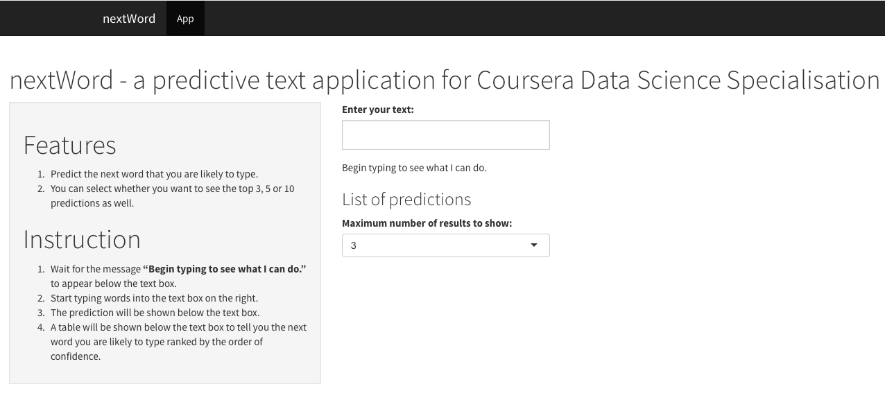

nextWord - a Coursera Data Science Specialisation Capstone Project
========================================================
author: kylase-coursera
date: 20 August 2015
font-import: http://fonts.googleapis.com/css?family=Open+Sans
font-family: 'Open Sans'

nextWord
========================================================

nextWord is a web application that predicts what you are about to type next.

It helps you to:
- save time

It can be used for formal writing (writing blogs, articles) as well as informal writing (social media, sms).

How the app works? (Part 1)
========================================================

nextWord uses a simple n-gram language model called Back-off Model to predict what you are most likely to type next.

This model predicts what you would type based on previous words you have entered. 

For example, you entered "Today I":
- It will firstly, find a match in the 3-grams model with "Today I", if there is a match provides the probable next word in order of descending probability.
- Otherwise, it will use the 2-grams model and use "I" to find a match and perform the same operation to find a probable match.

How the app works? (Part 2)
========================================================

The models are developed with data of various sources:
- news articles
- blogs 
- twitter 

That means you can input both formal and colloquial English and it can handle the predictions.

How to start using it?
========================================================

Visit [nextWord](https://kylase-coursera.shinyapps.io/capstone-app) on shinyapps.io. Wait for a few seconds for the app to initialise.

Enter what you want in the text box and check out the prediction provided below the text box and also the list of predictions further down the page.

